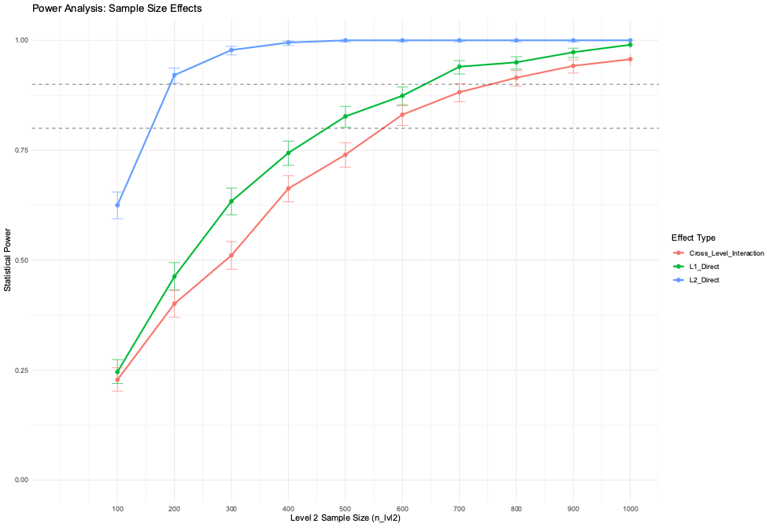

# “If You Only Knew the Power of the Dark Side”: Examining Within-Person Fluctuation in Psychological Need Frustration, Burnout, and Turnover Intentions Across a Workday.

Author & Maintainer: Demetrius K. Green 

[Email](mailto:dkgreen.iopsych@gmail.com) |  [GitHub](https://github.com/datasci-iopsy) |  [LinkedIn](https://www.linkedin.com/in/dkgreen-io/) | [ResearchGate](https://www.researchgate.net/profile/Demetrius-Green-2)

A dissertation **TO BE** submitted to the Graduate Faculty of North Carolina State University in partial fulfillment of the requirements for the degree of Doctor of Philosophy.

Industrial-Organizational Psychology

Raleigh, North Carolina (2025)

# Table of Contents
- [“If You Only Knew the Power of the Dark Side”: Examining Within-Person Fluctuation in Psychological Need Frustration, Burnout, and Turnover Intentions Across a Workday.](#if-you-only-knew-the-power-of-the-dark-side-examining-within-person-fluctuation-in-psychological-need-frustration-burnout-and-turnover-intentions-across-a-workday)
- [Table of Contents](#table-of-contents)
- [Overview](#overview)
- [Conceptual Framework](#conceptual-framework)
  - [Hypotheses (Proposed)](#hypotheses-proposed)
  - [Research Model (Proposed)](#research-model-proposed)
- [Measures](#measures)
  - [Level 1 Variables (L1)](#level-1-variables-l1)
    - [Shirom-Melamed Burnout Measure (*SMBM; Shirom \& Melamed, 2006*)](#shirom-melamed-burnout-measure-smbm-shirom--melamed-2006)
    - [Basic Psychological Needs Thwarting Scale (*PNTS; Bartholomew et al., 2011*)](#basic-psychological-needs-thwarting-scale-pnts-bartholomew-et-al-2011)
    - [Attitude Toward the Color Blue (*ATCB; Miller et al., 2024*; *Miller \& Simmering, 2023*)](#attitude-toward-the-color-blue-atcb-miller-et-al-2024-miller--simmering-2023)
    - [Meeting Characteristics](#meeting-characteristics)
    - [Turnover Intentions (*Spector et al., 1988*)](#turnover-intentions-spector-et-al-1988)
  - [Level 2 Variables (L2)](#level-2-variables-l2)
    - [Psychological Contract (*Robinson \& Morrison, 2000*)](#psychological-contract-robinson--morrison-2000)
    - [Job Satisfaction (*Fisher et al., 2016, p. 20*)](#job-satisfaction-fisher-et-al-2016-p-20)
    - [International Positive and Negative Affect Schedule Short Form (*I-PANAS-SF; Thompson, 2007*)](#international-positive-and-negative-affect-schedule-short-form-i-panas-sf-thompson-2007)
    - [Demographic Variables (*Hughes et al., 2022*)](#demographic-variables-hughes-et-al-2022)
  - [Analytical Strategy (Proposed)](#analytical-strategy-proposed)
    - [Descriptive Statistics](#descriptive-statistics)
    - [Reliability](#reliability)
    - [Common Method Variance \& Factor Structure](#common-method-variance--factor-structure)
    - [A Priori Sensitivity Analysis of Power](#a-priori-sensitivity-analysis-of-power)
    - [Mixed-Effects (Multilevel) Modeling](#mixed-effects-multilevel-modeling)
- [Limitations](#limitations)

# Overview

The objective of this study is to investigate, parse, quantify, and compare the within- and between-person variability of burnout and basic psychological need frustrations when predicting turnover intentions over the course of a workday. Given the longitudinal nature of this study, a repeated measures design is employed and analyzed using a mixed-effects model approach for enhanced statistically flexibility.

# Conceptual Framework

Participants will be measured across three timepoints within a single respective workday. There will be specific item-stems that corresponds to a particular timepoint: (1) Since starting work today, (2) Since the first survey check-in, and (3) Since the last survey check-in. Items within each variable-block will be randomized to reduce order bias.

<ins>Level 1 Variables (L1)</ins>: time-varying | <ins>Level 2 Variables (L2)</ins>: time-invariant

**Criterion Variable**:

- Turnover Intentions (*L1*)

**Predictor Variables**:

- Burnout (*L1*)
- Need Frustration (*L1*)
- Meeting Characteristics (*L1*)
- Psychological Contract (*L2*)
- Job Satisfaction (*L2*)

**Control Variables (Covariates)**:

- Positive & Negative Affect (*L2*)
- Age (*L2*)
- ~~Ethnicity (*L2*)~~
- ~~Gender (*L2*)~~
- Job Tenure (*L2*)
- ~~Education Level (*L2*)~~
- Remote Flag (*L2*)

**Marker Variable**: 

- Attitude Toward the Color Blue (*L1*)

## Hypotheses (Proposed)

- **H1.**  Burnout (i.e., (a) physical fatigue, (b) cognitive weariness, and (c) emotional exhaustion) will be positively related to turnover intentions at the within-person level.

- **H2.** Need frustration (i.e., (a) competency thwarting, (b) autonomy thwarting, and (c) relatedness thwarting) will be positively related to turnover intentions at the within-person level.

- **H3.** The positive within-person relationship between burnout and turnover intentions will be moderated by meeting characteristics, such that meeting characteristics (i.e., (a) number of meetings and (b) amount of time spent in meetings) strengthens the relationship. 

- **H4.** The positive within-person relationship between need frustration and turnover intentions will be moderated by meeting characteristics, such that meeting characteristics (i.e., (a) number of meetings and (b) amount of time spent in meetings) strengthens the relationship.

- **H5.** The positive within-person relationship between burnout and turnover intentions will be moderated by psychological contract perceptions, such that psychological contract perceptions (i.e., (a) perceived breach and (b) violation) at the between-level strengthen the within-person relationship.

- **H6.** The positive within-person relationship between need frustration and turnover intentions will be moderated by psychological contract perceptions, such that psychological contract perceptions (i.e., (a) perceived breach and (b) violation) at the between-level strengthen the within-person relationship.

- **H7.** The positive within-person relationship between burnout and turnover intentions will be moderated by job satisfaction, such that job satisfaction at the between-level weaken the within-person relationship.

- **H8.** The positive within-person relationship between need frustration and turnover intentions will be moderated by job satisfaction, such that job satisfaction at the between-level weaken the within-person relationship.

## Research Model (Proposed)

# Measures

## Level 1 Variables (L1)

### Shirom-Melamed Burnout Measure ([*SMBM; Shirom & Melamed, 2006*](https://psycnet.apa.org/record/2006-07100-003))

*{Timepoint-stem}*, indicate how often you have experienced the following feelings or behaviors?

Response Anchors: Frequency-based (see [*Tong et al., 2020*](https://pubmed.ncbi.nlm.nih.gov/31952162/) for vague vs. precise justification)

- 1 = Never
- 2 = Once
- 3 = Twice
- 4 = Three times
- 5 = More than three times

Expand for items

**Physical Fatigue**

1. I have felt tired.
2. I have been lacking energy for my work.
3. I have felt physically drained.
4. I have felt fed-up.
5. I have felt like my “batteries” are “dead.”
6. I have felt like burned out.

**Cognitive Weariness**

1. My thinking process has been slow.
2. I have had difficulty concentrating.
3. I have felt like I am not thinking clearly.
4. I have felt like I am not focused on my thinking.
5. I have had difficulty thinking about complex things.

**Emotional Exhaustion**

1. I feel I have been unable to be sensitive to the needs of coworkers or customers.
2. I feel I have been incapable of investing emotionally in coworkers or customers.
3. I feel I have been incapable of being sympathetic to coworkers or customers.
 

---

### Basic Psychological Needs Thwarting Scale ([*PNTS; Bartholomew et al., 2011*](https://pubmed.ncbi.nlm.nih.gov/21451172/))

*{Timepoint-stem}*, indicate the extent to which you agree or disagree with the following statements about your experiences so far at work.

Response Anchors: Agreement-based

- 1 = Strongly disagree
- 2 = Disagree
- 3 = Neither agree nor disagree
- 4 = Agree
- 5 = Strongly agree

Expand for items

**Competency Thwarting**

1. I have felt incompetent because others have put unrealistic expectations on me.
2. I have been told things that made me feel incompetent.
3. There have been situations where I was made to feel inadequate.
4. I have felt inadequate because I have not been given opportunities to fulfil my potential.

**Autonomy Thwarting**

1. I have felt prevented from making choices regarding the way I approach my work.
2. I have felt pushed to behave in certain ways.
3. I have felt obliged to follow work decisions made for me.
4. I have felt under pressure to agree with the work regimen provided to me.

**Relatedness Thwarting**

1. I have felt rejected by those around me.
2. I have felt like others are dismissive of me.
3. I have felt like other people dislike me.
4. I have felt like some of my coworkers are envious of my work or ideas.

---

### Attitude Toward the Color Blue ([*ATCB; Miller et al., 2024*](https://pubmed.ncbi.nlm.nih.gov/39009822/); [*Miller & Simmering, 2023*](https://journals.sagepub.com/doi/abs/10.1177/10944281221075361))

*{Timepoint-stem}*, indicate the extent to which you agree or disagree with the following statements.

Response Anchors: Agreement-based

- 1 = Strongly disagree
- 2 = Disagree
- 3 = Neither agree nor disagree
- 4 = Agree
- 5 = Strongly agree

Expand for items

1. ~~Blue is a beautiful color~~
2. Blue is a lovely color
3. ~~Blue is a pleasant color~~
4. ~~The color blue is wonderful~~
5. Blue is a nice color
6. I think blue is a pretty color
7. I like the color blue

---

### Meeting Characteristics

Expand for items

1. *{Timepoint-stem}*, how many meetings have you attended?
   - Response Anchors: Count-based (i.e., integer-type)
     - 0 to *n*

2. *{Timepoint-stem}*, how much time (in minutes) have you spent in meetings?
    - Response Anchors: Continuous
      - 0 to *n*

---

### Turnover Intentions ([*Spector et al., 1988*](https://psycnet.apa.org/record/1989-10417-001))

*Note:* See [*Matthews et al., 2022*](https://psycnet.apa.org/record/2022-55095-001) for theoretical justification of single item measures.

*{Timepoint-stem}*, how often have you thought about leaving your current employer?

Response Anchors: Frequency-based
- 1 = Never
- 2 = Once
- 3 = Twice
- 4 = A few times
- 5 = Very often

---

## Level 2 Variables (L2)

### Psychological Contract ([*Robinson & Morrison, 2000*](https://psycnet.apa.org/record/2000-00379-003))

Indicate the extent to which you agree or disagree with the following statements regarding your experiences with your current employer.

Response Anchors: Agreement-based
- 1 = Strongly disagree
- 2 = Disagree
- 3 = Neither agree nor disagree
- 4 = Agree
- 5 = Strongly agree

Expand for items

**Perceived Contract Breach**

1. Almost none of the promises made by my employer have been kept so far.
2. I feel that my employer has failed to fulfill the promises made to me when I was hired.
3. So far, my employer has done a poor job of fulfilling its promises to me.
4. I have not received everything my employer promised to me in exchange for my contributions.
5. My employer has broken many of its promises to me, even though I have upheld my side of the deal.

**Violation**

1. I feel a significant amount of anger toward my organization.
2. I feel deeply betrayed by my organization.
3. I feel that my organization has seriously violated the contract between us.
4. I feel extremely frustrated with how I have been treated by my organization.

---

### Job Satisfaction ([*Fisher et al., 2016, p. 20*](https://psycnet.apa.org/record/2015-17466-001))

Overall, I am satisfied with my job.

Response Anchors: Agreement-based
- 1 = Strongly disagree
- 2 = Disagree
- 3 = Neither agree nor disagree
- 4 = Agree
- 5 = Strongly agree

---

### International Positive and Negative Affect Schedule Short Form ([*I-PANAS-SF; Thompson, 2007*](https://psycnet.apa.org/record/2007-03451-007))

Thinking about yourself and your general emotional tendencies, how often do you feel:

Response Anchors: Frequency-based

- 1 = Never
- 2 = Rather infrequently
- 3 = Some of the time
- 4 = Quite often
- 5 = Always

Expand for items

**Positive Affect**

1. Alert
2. Inspired
3. Determined
4. Attentive
5. Active

**Negative Affect**

1. Upset
2. Hostile
3. Ashamed
4. Nervous
5. Afraid

---

### Demographic Variables ([*Hughes et al., 2022*](https://psycnet.apa.org/record/2023-67175-001))

Expand for items

1. Age (What is your age?)
   - Integer

2. Ethnicity (What best describes your ethnic background?)
   - American Indian or Alaska Native
   - Asian
   - Black or African American
   - Arab, Middle Eastern, or North African
   - Hispanic or Latino
   - Native Hawaiian or Other Pacific Islander
   - White or Caucasian
   - Two or more races
   - Prefer not to say

3. Gender (What best describes your gender identity?)
   - Woman
   - Man
   - Non-binary
   - Other
   - Prefer not to say

4. Job Tenure (How long have you been in your current role?)
   - Less than a year
   - 1 to 3 years
   - 3 to 5 years
   - More than 5 years

5. Education Level (What is the highest degree or level of school you have <ins>**completed**</ins>?)**
   - Some high school, no diploma
   - High school diploma or the equivalent (e.g., GED)
   - Some college, no degree
   - Vocational training 
   - Associate degree
   - Bachelor’s degree
   - Master’s degree
   - Professional or Doctorate degree

6. Remote Flag (Will you be working remotely on the date you selected to to receive the follow-up surveys?)
   - True
   - False

---

## Analytical Strategy (Proposed)

### Descriptive Statistics

- ~~Missing data analysis~~ (moot since only complete responses will be used)
- Outlier detection and handling (e.g., z-scores, boxplots/violent plots, etc.)
- Careless responding analysis (*Meade & Craig, 2012*)
- Means, standard deviations, and ranges for all variables
- Normality checks for continuous variables (e.g., skewness and kurtosis, Shapiro-Wilk test, etc.)
- Frequencies for categorical variables
  - Visualizations of group differences (e.g., bar plots, violin plots, etc.)
  - Effect size calculations (e.g., Cohen's d, eta-squared) for group differences
- Visualizations of data distributions (e.g., histograms, boxplots, etc.)
- ~~Test for homoscedasticity (i.e., group differences)~~ (moot since mixed-effects approach will be used)
- Correlations between variables and visualizations of relationships
  - Pearson's *r* for continuous variables (L1 variables will be aggregated up to L2 level)
  - `rmcorr` exclusively for continuous variables at the L1 level
- Intraclass Correlation Coefficients (ICCs) to assess within- and between-person variability (this will also determine if the within-person variables show intraindividual variability)
  - Low ICC implies more within-person fluctuation, high ICC implies more between-person stability
  - If within-person predictor meaningfully varies, include person mean at Level 2
  - If within-person predictor does not vary, treat it as a Level 2 predictor instead (or drop the within-person term for that variable)
  - In order to test within- and between-person difference, grand mean center the Level 1 tim-varying variable and include the person mean at Level 2; this parameterization directly tests the contextual difference (BP - WP) and is algebraically equivalent to person-mean centering under fixed within-person slopes.

### Reliability

- Composite index (McDonald’s omega, see *Geldhof et al., 2014; Fu, Wen, & Wang, 2022; Yang et al., 2022* for theoretical justification)

### Common Method Variance & Factor Structure

- CFA Marker Technique (see *Williams, Hartman, & Cavazotte, 2010*)
- Multilevel CFA

### A Priori Sensitivity Analysis of Power

The author developed an [R program](/srcR/run_power_analysis) to run robust sensitivity analyses of power based on the work of *Arend & Schäfer, 2019*. The program leverages the `furrr` (for parallelization) and `simr` packages in R. The original work of *Arend & Schäfer, 2019* was expanded to focus on a (customizable) matrix comprising the following parameters (values listed within parentheses are proposed in the current study):

Parameter Variations:
- Level 1 sample size (3)
- Level 2 sample sizes (100, 200, 300, 400, 500, 600, 700, 800, 900, 1000)
- Level 1 direct effect size (0.10, 0.30, 0.50)
- Level 2 direct effect size (0.10, 0.30, 0.50)
- Cross-level effect size (0.10, 0.30, 0.50)
- ICC values (0.10, 0.30, 0.50)
- Random slope variance values (0.01, 0.09, 0.25)
- Significance level (0.05)

There are a few more configurable values included in the program, but the current study's setup created a 10 × 3 × 3 × 3 × 3 × 3 = **2,430 design matrix** where each cell represented a unique combination of parameters. The simulations were run for 1,000 iterations per cell, resulting in a total of **2,430,000 simulations**. To review the code and get a detailed breakdown along with instructions on how to run the process, see the program's [README](srcR/run_power_analysis/README.md). *Note:* The sample sizes were split in half (but retained all other parameter values) and run on two different virtual (i.e., set 1: 100, 300, 500, 700, 900; set 2: 200, 400, 600, 800, 1000). The outputs were then combined into a single table for analysis.

Each power analysis calculated detection probability for three effects:
- L1 Direct Effect
- L2 Direct Effect
- Cross-Level Interaction

By systematically varying key assumptions (ICC, effect sizes, random slope variance, etc.) and running simulations, the program provided insights into the sensitivity of power estimates under different conditions. Figure 1 illustrates the power curves generated from the simulations using the aforementioned parameters with a small Level 1 effect and other parameters set to their medium values.

### Mixed-Effects (Multilevel) Modeling

(see *McNeish & Matta, 2018*)

---

**Empty/Null/Unconditional Means, Random Intercept**:

*Note*. Replace *TI* with all other Level 1 variables (i.e., BURN.PHY, NF.COMP, etc.) to get the respective ICCs.

$$
\begin{aligned}
\text{Level 1:}& \quad TI_{ti} = \beta_{0i} + \epsilon_{ti} \\
\text{Level 2:}& \quad \beta_{0i} = \gamma_{00} + \mu_{0i}
\end{aligned}
$$

Composite Notation:

$$
\begin{aligned}
\quad TI_{ti} = \gamma_{00} + \mu_{0i} + \epsilon_{ti}
\end{aligned}
$$

---

**Random Intercepts, Fixed Slopes (Full Research Model)**:

The within-person predictors are person-mean centered and is indicated by "WP" in the notation (e.g., $X_{ti} - \overline X_{i}$). The between-person predictors are grand mean centered and is indicated by "BP" in the notation (e.g., $X_{i} - \overline X$). Inspiration drawn from [ChatGPT-5 review](https://www.perplexity.ai/search/attached-you-will-find-an-arti-WxzXWE_7Q7ifJf7F5TOhvA#0) of [*Du, C. et. al (2024)](https://doi.org/10.1186/s12877-024-05256-y). *Note*: $z_{i}$ is a placeholder for covariates but are consolidated for LaTex rendering purposes.

$$
\begin{aligned}
\text{Level 1:}& \quad TI_{ti} = \beta_{0i} + \beta_{1i}(BURN.PHY.WP_{ti}) + \beta_{2i}(BURN.COG.WP_{ti}) + \beta_{3i}(BURN.EMO.WP_{ti}) + \beta_{4i}(NF.COMP.WP_{ti}) + \beta_{5i}(NF.AUTO.WP_{ti}) + \beta_{6i}(NF.RLTD.WP_{ti})\\
& \quad\quad\quad\ + \beta_{7i}(MEET.COUNT.WP_{ti}) + \beta_{8i}(MEET.TIME.WP_{ti}) \\
& \quad\quad\quad\ + \beta_{9i}(MEET.COUNT.WP_{ti} \times BURN.PHY.WP_{ti}) + \beta_{10i}(MEET.COUNT.WP_{ti} \times BURN.COG.WP_{ti}) + \beta_{11i}(MEET.COUNT.WP_{ti} \times BURN.EMO.WP_{ti}) \\
& \quad\quad\quad\ + \beta_{12i}(MEET.COUNT.WP_{ti} \times NF.COMP.WP_{ti}) + \beta_{13i}(MEET.COUNT.WP_{ti} \times NF.AUTO.WP_{ti}) + \beta_{14i}(MEET.COUNT.WP_{ti} \times NF.RLTD.WP_{ti}) \\
& \quad\quad\quad\ + \epsilon_{ti} \\
&\quad \text{where } \epsilon_{ti} \sim N(0, \sigma^2) \\
\\
\end{aligned}
$$

$$
\begin{aligned}
\text{Level 2:}& \quad \beta_{0i} = \gamma_{00} + \gamma_{01}(BURN.PHY.BP_{i}) + \gamma_{02}(BURN.COG.BP_{i}) + \gamma_{03}(BURN.EMO.BP_{i}) + \gamma_{04}(NF.COMP.BP_{i}) + \gamma_{05}(NF.AUTO.BP_{i}) + \gamma_{06}(NF.RLTD.BP_{i}) \\
& \quad\quad\quad\ + \gamma_{07}(MEET.COUNT.BP_{i}) + \gamma_{08}(MEET.TIME.BP_{i}) \\
& \quad\quad\quad\ + \gamma_{09}(PSYK.BR_{i}) + \gamma_{10}(PSYK.VIO_{i}) + \gamma_{11}(JOBSAT_{i}) + \gamma_{12}(z_{i}) \\
& \quad\quad\quad\ + \mu_{0i} \\
&\quad \text{where } \mu_{0i} \sim N(0, \sigma_{\mu_0}^2) \\
\\
& \quad \beta_{1i} = \gamma_{10} + \gamma_{11}(PSYK.BR_{i}) + \gamma_{12}(PSYK.VIO_{i}) + \gamma_{13}(JOBSAT_{i}) \\
& \quad \beta_{2i} = \gamma_{20} + \gamma_{21}(PSYK.BR_{i}) + \gamma_{22}(PSYK.VIO_{i}) + \gamma_{23}(JOBSAT_{i}) \\
& \quad \beta_{3i} = \gamma_{30} + \gamma_{31}(PSYK.BR_{i}) + \gamma_{32}(PSYK.VIO_{i}) + \gamma_{33}(JOBSAT_{i}) \\
& \quad \beta_{4i} = \gamma_{40} + \gamma_{41}(PSYK.BR_{i}) + \gamma_{42}(PSYK.VIO_{i}) + \gamma_{43}(JOBSAT_{i}) \\
& \quad \beta_{5i} = \gamma_{50} + \gamma_{51}(PSYK.BR_{i}) + \gamma_{52}(PSYK.VIO_{i}) + \gamma_{53}(JOBSAT_{i}) \\
& \quad \beta_{6i} = \gamma_{60} + \gamma_{61}(PSYK.BR_{i}) + \gamma_{62}(PSYK.VIO_{i}) + \gamma_{63}(JOBSAT_{i}) \\
& \quad \beta_{7i} = \gamma_{70} \\
& \quad \beta_{8i} = \gamma_{80} \\
& \quad \beta_{9i} = \gamma_{90} \\
& \quad \beta_{10i} = \gamma_{100} \\
& \quad \beta_{11i} = \gamma_{110} \\
& \quad \beta_{12i} = \gamma_{120} \\
& \quad \beta_{13i} = \gamma_{130} \\
& \quad \beta_{14i} = \gamma_{140}
\end{aligned}
$$

Composite Notation:

TO BE DETERMINED...

---

# Limitations

Primarily, vague response anchors were used to assess frequency. While Tong et al. (2020) demonstrated that precise response options yield superior performance, the expedited timeline of this study necessitated the use of less specific anchors. In future research, particularly longitudinal studies spanning months or years or cross-sectional designs, employing more precise response options would likely enhance measurement reliability and validity.

The outcome variable, turnover intentions, was measured using a single item. While this approach is justified in the context of this study (see *Matthews et al., 2022*), it is important to acknowledge that single-item measures may not capture the full complexity of the construct. Future research should consider using multi-item measures to provide a more comprehensive assessment of turnover intentions. In addition, turnover intentions and all other variables used in the study were measured using a 5-point agreement-based Likert scale (1 to 5), which are ordinal in nature. While this approach is common in psychological research, it is important to acknowledge that treating ordinal data as interval data can lead to potential biases in parameter estimates and attenuated effect sizes.

All variables used in the study were self-reported, which raises concerns about common method variance (CMV) or same-source bias. This limitation is particularly relevant in the context of psychological constructs, where self-report measures are often used. While the study employed statistical techniques to assess and mitigate the impact of CMV, it is important to recognize that these methods cannot completely eliminate the potential influence of same-source bias on the findings (see *Williams, Hartman, & Cavazotte, 2010*). Future research should consider using multi-source data collection or longitudinal designs with lagged outcomes to address this concern more effectively. Although statistical analyses were conducted to assess the extent of same-source bias or common method bias, these methods cannot entirely eliminate its potential influence on the findings (See *Williams, Hartman, & Cavazotte, 2010**). Because this study was not an extensive longitudinal design, I decided not to use lagged outcomes as controls. It is plausible that common method variance may have influenced the results given the concurrent relationships between the predictors and turnover intentions (Gabriel et. al, 2019, Kim et. al, 2025). Future research should consider employing a more robust design to mitigate this concern, such as using multi-source data collection or longitudinal designs with lagged outcomes.

The sample is likely WEIRD (Western, Educated, Industrialized, Rich, Democratic) and limited to participants working standard 9-to-5 shifts. It is plausible that differences may emerge across non-standard shifts, warranting further investigation to explore potential variations (See *Alley & Cortina, 2023*).

The power analysis was conducted using a custom R program that simulates data based on the proposed model but including a single L1 and L2 variable. While this approach provides a robust framework for estimating power, it is important to note that the results are contingent upon the assumptions made in the simulation; the inclusion of multiple predictors typically means an increase in multicollinearity which leads to more inflated standard error estimates (i.e., reduced power). *Arend & Schäfer (2019)* state that multicollinearity has to be very high in order to cause a noticeable downward bias in power estimates (i.e., VIF ≥ 2 and VIF ≥ 5), so VIFs are reported to address this concern. Variations in effect sizes, ICC values, and other parameters can also significantly influence the power estimates, albeit some are more influential than others. Therefore, while the analysis offers valuable insights, it should be interpreted with caution and in the context of the specific research design and hypotheses.

Latent mean centering is recognized as a superior technique for disentangling fixed and random effects. However, implementing this approach in R presented significant challenges. A Bayesian framework may offer a more robust alternative by modeling means as distributions, thereby directly accounting for uncertainty in the estimates (see *Hamaker & Muthén, 2020*). In addition, sampling error in the group means exists because the literal group means were used as the L2 estimates. As with the previous point, there are ways to address this (empirical Bayes) but none are easily implemented with the R software..hence the limitation. See this [article](https://centerstat.org/biased-between-group-effects/) by Curran and Bauer. 

The specified model(s) in the study are based on fixed slopes; sampling and budgetary restrictions prevented me from conducting a more intensive longitudinal study which led to the decision to only model fixed slopes. Additionally, check out this link which explains why one should check for random slopes in the predictors as well [Perplexity](https://www.perplexity.ai/search/can-you-provide-a-comprehensiv-zuN14_igRg2ZVKnuFg.vCg#1).

Need satisfaction and need frustration are known to predict positive and negative outcomes differentially. This study focuses specifically on need thwarting or frustration, thereby capturing only one aspect of the broader dynamic. Future research should aim to provide a more balanced perspective by examining both need satisfaction and frustration. Perhaps a configurational (also known as person-oriented) approach could be employed to explore the interplay between need satisfaction, frustration, and the other relvenat study variables across time (i.e., multilevel finite mixture modeling).

At least three measurement occasions are necessary to estimate within-person effects. Stronger within-person effects might have been observed with more Level-1 data; perhaps there is a curvilinear (i.e., quadratic) trend in turnover intentions across the measurement occasions for which the present study did not account, but with so few measurement occasions, it is unlikely that a quadratic trend would be detected. Future research should consider including more measurement occasions to explore potential curvilinear relationships.

The study design could not directly assess the causal direction between the predictors and turnover intentions. While the proposed model suggests a directional relationship, it is important to acknowledge that the data are correlational in nature. Future research should consider employing experimental or quasi-experimental designs to establish causal relationships more definitively.

The sample size is too small to test the moderating relationships in a single model; in fact, some of the global constructs might have to be used due to power issues. Separate models will most likely have to be tested to get an understanding of the phenomena.