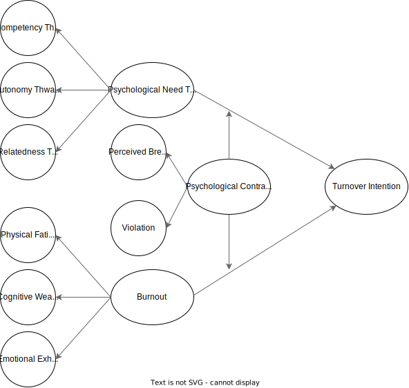

# "If you only knew the power of the dark side:" Examining fluctuations in psychological need frustration, burnout, and turnover intentions over the course of a workday.

Demetrius K. Green

North Carolina State University (2025)

Department: Industrial-Organizational Psychology

## Overview

The objective of this study is to investigate, parse, quantify, and compare the within- and between-person variability of burnout and basic psychological need frustrations when predicting turnover intentions over the course of a workday. Given the longitudinal nature of this study, a repeated measures design is utilized and analyzed using a mixed-effects paradigm for enhanced statistically flexibility.

## Conceptual Framework & Variables

Participants will be measured across three timepoints within a single workday. There will be specific *timepoint-stems* used to distinguish the intervals (e.g., "Since starting work today" or "Since the last survey check-in"). The items within each variable-block was randomized to reduce response bias (**citation TBD**).

<ins>Time Invariant Variables</ins>: Level 2 (*L2*)

<ins>Time Variant Variables</ins>: Level 1 (*L1*)

**Dependent Variable**: 
- Turnover Intention (*L1*)

**Independent Variables**:
- Burnout (*L1*)
- Basic Psychological Needs Thwarting (*L1*)

**Moderating Variables**:
- Psychological Contract (*L2*)
- Meetings (*L1*)

**Marker Variable**:
- Attitude Toward the Color Blue (*L1*)

**Control Variables**:
- Age (*L2*)
- Ethnicity (*L2*)
- Gender (*L2*)
- Job Tenure (*L2*)
- Education Level (*L2*)
- Remote Flag (*L2*)

### Dependent Variable

**Turnover Intention**s (*Spector et al., 1988*; see *Matthews et al., 2022* for theoretical justification of single item measures)

*{Timepoint-stem}*, how often have you felt the desire to leave your current employer?

Response Anchors: Frequency-based (vague vs. precise; see *Tong et al., 2020*)
- Never
- Rarely
- Sometimes
- Often
- Always

### Independent Variables

Shirom-Melamed Burnout Measure (*SMBM; Shirom & Melamed, 2006*)

*{Timepoint-stem}*, indicate how often you have experienced the following feelings or behaviors?

**Physical Fatigue**

1. I feel tired
2. I am lacking energy for my work
3. I feel physically drained
4. I feel fed-up
5. I feel like my “batteries” are “dead”
6. I feel burned out

**Cognitive Weariness**

1. My thinking process is slow
2. I have difficulty concentrating
3. I feel I am not thinking clearly
4. I feel I am not focused on my thinking
5. I have difficulty thinking about complex things

**Emotional Exhaustion**

1. I feel I am unable to be sensitive to the needs of coworkers or customers
2. I feel I am not capable of investing emotionally in coworkers or customers
3. I feel I am not capable of being sympathetic to coworkers or customers

Response Anchors: Frequency-based (vague vs. precise; see *Tong et al., 2020*)
- Never
- Rarely
- Sometimes
- Often
- Always

Basic Psychological Needs Thwarting Scale (*PNTS; Bartholomew et al., 2011a*)

**Competency Thwarting**

1. There are occasions where I feel incompetent because others impose unrealistic expectations upon me
2. There are times when I am told things that make me feel incompetent
3. There are situations where I am made to feel inadequate
4. I feel inadequate because I am not given opportunities to fulfil my potential

**Autonomy Thwarting**

1. I feel prevented from making choices regarding the way I train
2. I feel pushed to behave in certain ways
3. I feel obliged to follow training decisions made for me
4. I feel under pressure to agree with the training regimen I am provided

**Relatedness Thwarting**

1. I feel I am rejected by those around me
2. I feel others can be dismissive of me
3. I feel other people dislike me
4. I feel some of the coworkers around me are envious when I achieve success

### Moderating Variables

Psychological Contract (*Robinson & Morrison, 2000*)

*{Timepoint-stem}*, indicate the extent to which you agree or disagree with the following statements about your experiences so far.

**Perceived Contract Breach**

1. Almost none of the promises made by my employer have been kept so far.
2. I feel that my employer has failed to fulfill the promises made to me when I was hired.
3. So far, my employer has done a poor job of fulfilling its promises to me.
4. I have not received everything my employer promised to me in exchange for my contributions.
5. My employer has broken many of its promises to me, even though I have upheld my side of the deal.

**Violation**

1. I feel a significant amount of anger toward my organization.
2. I feel deeply betrayed by my organization.
3. I feel that my organization has seriously violated the contract between us.
4. I feel extremely frustrated with how I have been treated by my organization.

Response Anchors: Agreement-based
- Strongly agree
- Somewhat agree
- Neither agree nor disagree
- Somewhat disagree
- Strongly disagree

Meetings

**Number of Work Meetings**

1. *{Timepoint-stem}*, how many meetings have you attended?
   - Response Anchors: Count-based 
     - 0 to *n*

**Time in Work Meetings**

1. *{Timepoint-stem}*, how much time have you spent in meetings? How much time (in hours) have you spent in meetings?
    - Response Anchors: Continuous
      - 0 to *n*

### Marker Variables

Attitude Toward the Color Blue (*ATCB; Miller et al., 2024; Miller & Simmering, 2023*; see *Miller et al., 2024* for theoretical justification of 4-item measure).

**Attitude Toward the Color Blue**

1. ~~Blue is a beautiful color~~
2. Blue is a lovely color
3. ~~Blue is a pleasant color~~
4. ~~The color blue is wonderful~~
5. Blue is a nice color
6. I think blue is a pretty color
7. I like the color blue

Response Anchors: Agreement-based
- Strongly agree
- Somewhat agree
- Neither agree nor disagree
- Somewhat disagree
- Strongly agree

### Attention Checks

Instructed Response Item (IRI)

Please select *{Response Anchor}* for this survey item.

Response Anchors: Agreement-based
- Strongly agree
- Somewhat agree
- Neither agree nor disagree
- Somewhat disagree
- Strongly disagree

### Control Variables 

See *Bernerth & Aguinis, 2016* for theoretical justification.

International Positive and Negative Affect Schedule Short Form (I-PANAS-SF; *Thompson, 2007*)

Thinking about yourself and your general emotional tendencies, how often do you feel:

**Positive Affect**

1. Alert
2. Inspired
3. Determined
4. Attentive
5. Active

**Negative Affect**

1. Upset
2. Hostile
3. Ashamed
4. Nervous
5. Afraid

Response Anchors: Frequency-based
- Never
- Rather infrequently
- Some of the time
- Quite often
- Always

### Demographic Variables

1. Age (What is your age?)
   - Integer

2. Ethnicity (What best describes your ethnic background?)
   - American Indian or Alaska Native
   - Asian
   - Black or African American
   - Hispanic or Latino
   - Native Hawaiian or Other Pacific Islander
   - Two or more races
   - White/Caucasian
   - Prefer not to say

3. Gender (What best describes your gender identity?)
   - Woman
   - Man
   - Non-binary
   - Other
   - Prefer not to say

4. Organization Tenure (How long have you been in your current role?)
   - Less than a year
   - 1 to 3 years
   - 3 to 5 years
   - More than 5 years

5. Education Level (What is the highest degree or level of school you have <ins>**completed**</ins>?)**
   - Some high school, no diploma
   - High school diploma or the equivalent (e.g., GED)
   - Some college, no degree
   - Vocational training 
   - Associate degree
   - Bachelor’s degree
   - Master’s degree
   - Professional or Doctorate degree

6. Remote Flag (Will you be working remotely on the date you selected to complete this survey series?)
   - True
   - False

## Process Model

## Analytical Strategy

### Reliability
- Composite index (McDonald’s omega, see *Geldhof et al., 2014; Fu, Wen, & Wang, 2022; Yang et al., 2022* for theoretical justification)

### Correlation
- Between-persons
- Within-persons

### Common Method Variance & Factor Structure
- CFA Marker Technique (see *Williams, Hartman, & Cavazotte, 2010*)
- Multilevel CFA

### Power Analysis

### Mixed Effects Modeling | Latent Growth Curve Modeling 
(see *McNeish & Matta, 2018*)

---

**Empty/Null/Unconditional Model**:

$$
\begin{aligned}
\text{Level 1:}& \quad TI_{it} = \beta_{0i} + \epsilon_{it} \\
\text{Level 2:}& \quad \beta_{0i} = \gamma_{00} + \mu_{0i}
\end{aligned}
$$

Composite Notation:

$$
\begin{aligned}
\quad TI_{it} = \beta_{0} + \mu_{0i} + \epsilon_{it}
\end{aligned}
$$

---

**Fixed (Time) Effect, Random Intercept Model**:

$$
\begin{aligned}
\text{Level 1:}& \quad TI_{it} = \beta_{0i} + \beta_{1i}(TIME_{it}) + \epsilon_{it} \\
\text{Level 2:}& \quad \beta_{0i} = \gamma_{00} + \mu_{0i} \\
& \quad \beta_{1i} = \gamma_{10}
\end{aligned}
$$

Composite Notation:

$$
\quad TI_{it} = \gamma_{00} + \gamma_{10}(TIME_{it}) + \mu_{0i} + \epsilon_{it}
$$

---

**Random (Time) Effect, Random Intercept Model**:

$$
\begin{aligned}
\text{Level 1:}& \quad TI_{it} = \beta_{0i} + \beta_{1i}(TIME_{it}) + \epsilon_{it} \\
\text{Level 2:}& \quad \beta_{0i} = \gamma_{00} + \mu_{0i} \\
& \quad \beta_{1i} = \gamma_{10} + \mu_{1i}
\end{aligned}
$$

Composite Notation:

$$
\quad TI_{it} = \gamma_{00} + \gamma_{10}(TIME_{it}) + \mu_{0i} + \mu_{1i}(TIME_{it}) + \epsilon_{it}
$$

  - Intraclass Correlation (ICC)
  - Moderation
    - Within- and Cross-level interactions
  - Group mean centering *L1* variables

## Limitations

Primarily, vague response anchors were used to assess frequency. While Tong et al. (2020) demonstrated that precise response options yield superior performance, the expedited timeline of this study necessitated the use of less specific anchors. In future research, particularly longitudinal studies spanning months or years or cross-sectional designs, employing more precise response options would likely enhance measurement reliability and validity.

Although statistical analyses were conducted to assess the extent of same-source bias or common method bias, these methods cannot entirely eliminate its potential influence on the findings (See *Williams, Hartman, & Cavazotte, 2010**).

The sample is likely WEIRD (Western, Educated, Industrialized, Rich, Democratic) and limited to participants working standard 9-to-5 shifts. It is plausible that differences may emerge across non-standard shifts, warranting further investigation to explore potential variations (See *Alley & Cortina, 2023*).

Latent mean centering is recognized as a superior technique for disentangling fixed and random effects. However, implementing this approach in R presented significant challenges. A Bayesian framework may offer a more robust alternative by modeling means as distributions, thereby directly accounting for uncertainty in the estimates (see *Hamaker & Muthén, 2020*).

Need satisfaction and need frustration are known to predict positive and negative outcomes differentially. This study focuses specifically on need thwarting or frustration, thereby capturing only one aspect of the broader dynamic. Future research should aim to provide a more balanced perspective by examining both need satisfaction and frustration.