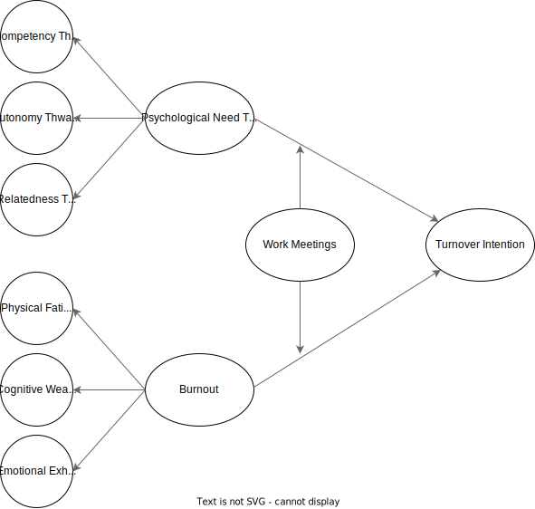

# "If you only knew the power of the dark side:" Examining fluctuations in psychological need frustration, burnout, and turnover intentions over the course of a workday.

Demetrius K. Green

North Carolina State University (2024)

Psychology Department: Industrial-Organizational Psychology

## Overview

The objective of this study is to investigate, parse, quantify, and compare the within- and between-person variability of burnout and basic psychological need frustrations when predicting turnover intentions over the course of a workday. Given the longitudinal nature of this study, a repeated measures design is utilized and analyzed using a mixed-effects paradigm for enhanced statistically flexibility.

## Conceptual Framework & Variables

Participants will be measured across three timepoints within a single workday contingent upon their shift (e.g., 1st shift: 09:00 to 17:00, 2nd shift: 16:00 to 00:00, 3rd shift: 23:00 to 07:00). The dependent, independent, moderating, and marker variables are time invariant; that is, they will be measured across the three timepoints. The attention check items will also be included across the three timepoints. The control variables (demographics inclusive), however, will only be measured once at timepoint “0.” 

### Dependent Variables

Turnover Intentions (*Spector et al., 1988*)

Response Anchors: Frequency-based
- Never
- Rather infrequently
- Some of the time
- Quite often
- Always

Turnover Intention (see *Matthews et al., 2022* for theoretical justification of single item measures)

1. How often have you seriously considered leaving your current job so far today?

### Independent Variables

Shirom-Melamed Burnout Measure (SMBM; *Shirom & Melamed, 2006*)

Response Anchors: Frequency-based (vague vs. precise; see *Tong et al., 2020*)
- Never
- Once 
- A few times
- Several times 
- Very frequently

Subscales

**Physical Fatigue**

1. I feel tired
2. I am lacking energy for my work
3. I feel physically drained
4. I feel fed-up
5. I feel like my “batteries” are “dead”
6. I feel burned out

**Cognitive Weariness**

1. My thinking process is slow
2. I have difficulty concentrating
3. I feel I am not thinking clearly
4. I feel I am not focused on my thinking
5. I have difficulty thinking about complex things

**Emotional Exhaustion**

1. I feel I am unable to be sensitive to the needs of coworkers or customers
2. I feel I am not capable of investing emotionally in coworkers or customers
3. I feel I am not capable of being sympathetic to coworkers or customers

Basic Psychological Needs Thwarting Scale (PNTS; *Bartholomew et al., 2011a*)

Response Anchors: Agreement-based
- Strongly disagree
- Disagree
- Neither agree nor disagree
- Agree
- Strongly agree

Subscales

Competency Thwarting

1. There are occasions where I feel incompetent because others impose unrealistic expectations upon me
2. There are times when I am told things that make me feel incompetent
3. There are situations where I am made to feel inadequate
4. I feel inadequate because I am not given opportunities to fulfil my potential

Autonomy Thwarting

1. I feel prevented from making choices regarding the way I train
2. I feel pushed to behave in certain ways
3. I feel obliged to follow training decisions made for me
4. I feel under pressure to agree with the training regimen I am provided

Relatedness Thwarting	
1. I feel I am rejected by those around me
2. I feel others can be dismissive of me
3. I feel other people dislike me
4. I feel some of the coworkers around me are envious when I achieve success

### Moderating Variables

Number of Work Meetings

1. How many meetings have you attended?
   - Response Anchors: Count-based 
     - 0 to *n*

Time in Work Meetings

1. How much time (in hours) have you spent in meetings? *Note*: use divisible increments (15 mins = .25 hours, 30 mins = .50 hours, 60 mins = 1 hour, etc.). 
    - Response Anchors: Continuous
      - 0 to *n*

### Marker Variables

Attitude Toward the Color Blue (ATCB; *Miller et al., 2024; Miller & Simmering, 2023*)

Response Anchors: Agreement-based
- Strongly agree
- Somewhat agree
- Neither agree nor disagree
- Somewhat disagree
- Strongly agree

Subscale

Color Blue
1. Blue is a beautiful color
2. Blue is a lovely color
3. Blue is a pleasant color
4. The color blue is wonderful
5. Blue is a nice color
6. I think blue is a pretty color
7. I like the color blue

### Attention Checks

Instructed Response Item (IRI)

Response Anchors: Agreement-based
- Strongly agree
- Somewhat agree
- Neither agree nor disagree
- Somewhat disagree
- Strongly disagree

T1: Please select “Neither agree nor disagree” for this question.

T2: Please select “Strongly agree” for this question.

T3: Please select “Somewhat disagree” for this question.

Factual Item

Response Anchors: Nominal
- Tiger
- Chair
- Watermelon
- Green

T1: Please select the option that represents a fruit

T2: Please select the option that represents an animal

T3: Please select the option that represents a color

### Control Variables (see *Bernerth & Aguinis, 2016* for theoretical justification)

International Positive and Negative Affect Schedule Short Form (I-PANAS-SF; *Thompson, 2007*)

Response Anchors: Frequency-based
- Never
- Rather infrequently
- Some of the time
- Quite often
- Always

Subscales

Positive Affect
1. Alert
2. Inspired
3. Determined
4. Attentive
5. Active

Negative Affect
1. Upset
2. Hostile
3. Ashamed
4. Nervous
5. Afraid

### Demographic Variables

1. Age (What is your age?)
   - Integer

2. Ethnicity (What best describes your ethnic background?)
   - American Indian or Alaska Native
   - Asian
   - Black or African American
   - Hispanic or Latino
   - Native Hawaiian or Other Pacific Islander
   - Two or more races
   - White/Caucasian
   - Prefer not to say

3. Gender (What best describes your gender identity?)
   - Woman
   - Man
   - Non-binary
   - Other
   - Prefer not to say

4. Organization Tenure (How long have you been in your current role?)
   - Less than a year
   - 1 to 3 years
   - 3 to 5 years
   - More than 5 years

5. Education Level (What is the highest degree or level of school you have completed?)
   - Some high school, no diploma
   - High school diploma or the equivalent (e.g., GED)
   - Some college, no degree
   - Vocational training 
   - Associate degree
   - Bachelor’s degree
   - Master’s degree
   - Professional or Doctorate degree

6. Remote Flag (Are you working remotely today for the duration of the survey?)
   - True
   - False

## Process Model

